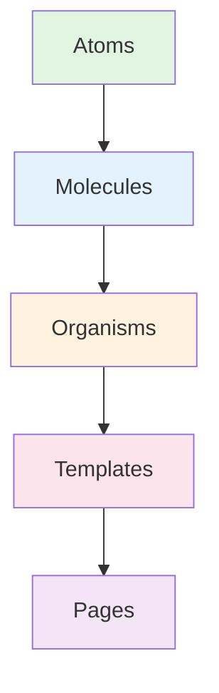
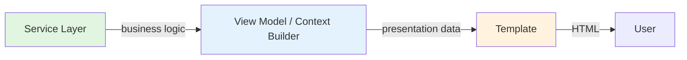

# Atomic Design for Jinja2 Templates (FastAPI + HTMX)

**Skill ID:** `jinja2-atomic-design`
**Version:** 3.0.0
**Last Updated:** 2024

**Triggers:** jinja2, template, atomic design, component, macro, htmx template, reusable component, template refactor, frontend patterns

---

## Version History

- **v3.0.0** (2024): **Production-Grade Enhancements**
  - File Organization: Atom Libraries (50+ files → 5-10 libraries)
  - Tailwind 4: Class merging with `tw_merge` filter
  - View Models: Pydantic contracts for type safety + security
  - HTMX Edge Cases: Scoped IDs, valid markup, out-of-band swaps
  - Testing HTMX+Tailwind: Playwright visual regression, CI/CD integration
- **v2.0.0** (2024): Advanced Patterns, HTMX Fragment Libraries, Separation of Concerns, When NOT to Create Component, Naming Conventions, Team Onboarding, ADVANCED_PATTERNS.md
- **v1.0.0** (2024): Initial hierarchy, HTMX patterns, refactoring checklist

---

## Purpose

Master Atomic Design methodology for creating reusable, maintainable Jinja2 templates in FastAPI + HTMX applications. Build scalable component hierarchies that promote DRY principles and consistent UI patterns.

## When to Use This Skill

- Creating new UI components in Jinja2 templates
- Refactoring duplicate template code
- Building component libraries for server-side rendering
- Implementing design systems in SSR applications
- Working with HTMX fragments and partials
- Maintaining consistency across multiple pages

## Atomic Design Hierarchy



### 1. Atoms (templates/common/partials/)

**Definition:** Smallest building blocks. Cannot be broken down further while remaining functional.

**Examples:**
- Icons (file, user, close)
- Buttons (primary, secondary, icon-only)
- Inputs (text, checkbox, radio)
- Labels, badges, pills
- Loading spinners

**Characteristics:**
- ✅ Single responsibility
- ✅ Highly reusable
- ✅ Parameterized with sensible defaults
- ✅ No business logic
- ✅ Pure presentation

**Location:** `templates/common/partials/`

**Example:**

```jinja
{# templates/common/partials/file_source_icon.html.jinja #}
{#
  Atomic Component: File Source Icon
  Category: Atom

  Purpose: Renders a file source icon based on the source name

  Usage:
    
    {{ file_source_icon(source_name='SHAREPOINT') }}
    {{ file_source_icon(source_name='FDA', size_class='h-8 w-8') }}

  Parameters:
    - source_name (str|None): Source type (SHAREPOINT, FDA, ERN, CTIS)
    - size_class (str): Container size. Default: 'h-6 w-6'
    - icon_size (str): Icon size for generic fallback. Default: 'size-3'
    - additional_classes (str): Extra CSS classes. Default: ''
#}




  
    <span class="flex {{ size_class }} shrink-0 items-center justify-center rounded-xs border border-gray-100 bg-white {{ additional_classes }}">
      
    </span>
  
    <span class="flex {{ size_class }} shrink-0 items-center justify-center rounded-xs border border-gray-100 bg-white {{ additional_classes }}">
      
    </span>
  
    <span class="shrink-0 rounded-xs bg-blue-100 p-1.5 text-blue-500 {{ additional_classes }}">{{ file_icon(icon_size) }}</span>
  

```

### 2. Molecules (templates/{domain}/partials/)

**Definition:** Combinations of atoms that form functional units.

**Examples:**
- File name with icon
- Search input with button
- User avatar with name
- Card header with title and actions
- Form field with label and error

**Characteristics:**
- ✅ Composed of 2+ atoms
- ✅ Single functional purpose
- ✅ Domain-specific (can be generic)
- ✅ May contain minimal logic
- ✅ Accepts context data

**Location:** `templates/{domain}/partials/` or `templates/common/partials/`

**Example:**

```jinja
{# templates/data_management/files/partials/file_name_cell.html.jinja #}
{#
  Molecular Component: File Name Cell
  Category: Molecule

  Purpose: Renders file name with source icon and link

  Composed of:
    - file_source_icon (atom)
    - icons.file_icon (atom)

  Usage:
    
    {{ file_name_cell(file, user) }}
#}





  <div class="group relative flex flex-row items-center gap-2 px-4 py-2.5 text-sm font-normal">
    {{ file_source_icon(file.source.name if file.source else None) }}

    
      <a
        hx-get="/files/{{ file.id }}"
        hx-target="#aside-content"
        hx-swap="innerHTML"
        class="cursor-pointer truncate hover:underline">
        {{ file.full_name }}
      </a>
    
      <a href="/download-file/{{ file.id }}" class="cursor-pointer truncate hover:underline" download>
        {{ file.full_name }}
      </a>
    
      <span class="truncate">{{ file.full_name }}</span>
    

    {{ render_tooltip(file.full_name, '', 'top') }}
  </div>

```

### 3. Organisms (templates/{domain}/partials/)

**Definition:** Complex UI sections combining multiple molecules/atoms.

**Examples:**
- File table row with actions
- Navigation header with menu
- Comment section with replies
- Data table with sorting and pagination
- Form with multiple fields and validation

**Characteristics:**
- ✅ Contains business logic
- ✅ Domain-specific
- ✅ Manages state/interactions
- ✅ HTMX targets often here
- ✅ Self-contained functionality

**Location:** `templates/{domain}/partials/`

**Example:**

```jinja
{# templates/data_management/files/partials/file_table_row.html.jinja #}
{#
  Organism Component: File Table Row
  Category: Organism

  Purpose: Renders complete file row with status, actions, permissions

  Composed of:
    - file_name_cell (molecule)
    - status_pill (molecule)
    - action_buttons (molecules)
#}




<tr
  id="file-{{ file.id }}"
  class="border-y border-slate-200 transition-colors hover:bg-gray-50">
  <td>
    <div class="flex items-center gap-2">
      {{ file_source_icon(file.source.name if file.source else None) }}
      <span>{{ file.full_name }}</span>
    </div>
  </td>
  <td>{{ file.document_type.name }}</td>
  <td>{{ status_pill(file) }}</td>
  
    <td class="inline-flex gap-2">
      <button
        hx-get="/files/{{ file.id }}/edit"
        hx-target="#modals">Edit</button>
      <button
        hx-delete="/files/{{ file.id }}"
        hx-confirm="Delete this file?">Delete</button>
    </td>
  
</tr>
```

### 4. Templates (templates/{domain}/)

**Definition:** Page layouts combining organisms into user-facing structures.

**Examples:**
- Files list page layout
- Conversation detail layout
- Dashboard layout
- Form page layout

**Characteristics:**
- ✅ Page structure
- ✅ Grid/flexbox layouts
- ✅ Responsive breakpoints
- ✅ Slot/block definitions
- ✅ Extends base templates

**Location:** `templates/{domain}/`

### 5. Pages (templates/{domain}/)

**Definition:** Specific template instances with real data.

**Location:** `templates/{domain}/`

---

## File Organization: Libraries vs Single Files

**Critical Decision:** Group related atoms into **libraries** (one file, multiple macros) instead of creating separate files for each atom.

### ❌ Anti-Pattern: File Proliferation

```text
templates/common/partials/
  button_primary.html.jinja       # 15 lines
  button_secondary.html.jinja     # 15 lines
  button_danger.html.jinja        # 15 lines
  button_ghost.html.jinja         # 15 lines
  input_text.html.jinja           # 12 lines
  input_email.html.jinja          # 12 lines
  input_password.html.jinja       # 12 lines
  checkbox.html.jinja             # 10 lines
  radio.html.jinja                # 10 lines
  # 50+ files of 5-15 lines each = navigation nightmare
```

**Problems:**
- Navigation overhead (find component X in 50+ files)
- 10+ import statements per template
- IDE slowdown with 100+ tiny files
- Harder to see related components together

### ✅ Solution: Atom Libraries

```text
templates/common/atoms/
  buttons.html.jinja      # btn_primary(), btn_secondary(), btn_danger(), btn_ghost()
  forms.html.jinja        # input_text(), input_email(), checkbox(), radio(), label_field()
  status.html.jinja       # status_pill(), status_badge(), progress_bar()
  icons.html.jinja        # icon_file(), icon_user(), icon_trash(), icon_edit()
  typography.html.jinja   # heading(), paragraph(), link(), code_block()
```

**Benefits:**
- **1 import** instead of 10: ``
- Related components co-located (all buttons in one place)
- Easier refactoring (change all button styles at once)
- Reduced file count (10 libraries vs 50 files)

**When to Split:**
- Library >500 lines → split by sub-category (e.g., `forms/inputs.html.jinja`, `forms/selects.html.jinja`)
- Atoms used across domains → keep in `common/atoms/`
- Domain-specific molecules → `{domain}/molecules/cards.html.jinja`

**Example Library:**

```jinja
{# templates/common/atoms/buttons.html.jinja #}
{#
  Atom Library: Buttons

  Exports:
    - btn_primary(text, hx_get=None, size='md', classes='')
    - btn_secondary(text, hx_get=None, size='md', classes='')
    - btn_danger(text, hx_delete=None, size='md', classes='')
    - btn_ghost(text, hx_get=None, size='md', classes='')

  Usage:
    
    {{ btn_primary('Save', hx_get='/save') }}
    {{ btn_danger('Delete', hx_delete='/files/123') }}
#}


  
  
  

  <button
    type="button"
    hx-get="{{ hx_get }}" hx-swap="outerHTML"
    class="{{ [base, sizes[size], variant, classes] | tw_merge }}">
    {{ text }}
  </button>



  {# Similar structure with secondary styles #}



  
  
  

  <button
    type="button"
    hx-delete="{{ hx_delete }}" hx-confirm="Are you sure?"
    class="{{ [base, sizes[size], variant, classes] | tw_merge }}">
    {{ text }}
  </button>



  {# Transparent button for less prominent actions #}

```

---

## Design Principles

### 1. Single Responsibility Principle (SRP)

Each component should do ONE thing well.

```jinja
{# ❌ BAD: Component does too much #}

  {# 200 lines of mixed concerns #}


{# ✅ GOOD: Split into focused components #}
...
...
...
```

### 2. Parameterization with Sensible Defaults

Make components flexible without overwhelming callers.

```jinja
{# ✅ GOOD: Sensible defaults #}

  <button
    type="{{ type }}"
    class="btn btn-{{ variant }} btn-{{ size }} {{ classes }}">
    {{ text }}
  </button>


{# Usage: Simple case #}
{{ button('Submit') }}

{# Usage: Customized #}
{{ button('Delete', variant='danger', size='sm') }}
```

### 3. Composition Over Duplication

Build complex components from simpler ones.

```jinja
{# ✅ GOOD: Compose from atoms #}




  <div class="card">
    {{ file_source_icon(file.source.name) }}
    <span>{{ file.name }}</span>
    {{ render_tooltip(file.description) }}
  </div>

```

### 4. Co-location of Related Components

Keep related components together.

```text
templates/
  common/
    partials/
      file_source_icon.html.jinja  # ← Atom (reusable everywhere)
      tooltip.html.jinja
      icons.html.jinja

  data_management/
    files/
      partials/
        file_name_cell.html.jinja  # ← Molecule (domain-specific)
        file_table_row.html.jinja  # ← Organism (domain-specific)
        status_pill.html.jinja
      index.html.jinja             # ← Template
```

### 5. Naming Conventions

Consistent naming prevents confusion and improves discoverability.

**File Naming:**

- **Atoms** (common): `{noun}.html.jinja` or `{noun}_{variant}.html.jinja`
  - Examples: `file_icon.html.jinja`, `button_danger.html.jinja`, `badge_status.html.jinja`

- **Molecules**: `{noun}_{noun}.html.jinja` (describe composition)
  - Examples: `file_name_cell.html.jinja`, `search_form.html.jinja`, `user_avatar_card.html.jinja`

- **Organisms**: `{domain}_{component}_row.html.jinja` or `{domain}_{section}.html.jinja`
  - Examples: `file_table_row.html.jinja`, `conversation_thread.html.jinja`, `user_permissions_panel.html.jinja`

- **Templates/Pages**: `{view_name}.html.jinja`
  - Examples: `index.html.jinja`, `detail.html.jinja`, `edit.html.jinja`

**Macro Naming:**

```jinja
{# ✅ GOOD: Verb or noun describing what it renders #}
...
...
...

{# ❌ BAD: Vague or inconsistent #}
...  {# Which icon? #}
...  {# Renders what part? #}
...  {# PascalCase not idiomatic for Jinja2 #}
```

### 6. Documentation-First Components

Every component MUST have a docstring.

### 7. Tailwind Class Merging (Critical for Tailwind 4)

**Problem:** Tailwind classes can conflict when combining base + variant + custom classes.

```jinja
{# ❌ BAD: Conflicting classes (p-4 vs p-2) #}
<div class="p-4 rounded-lg {{ 'p-2' if compact else '' }}">
  {# Result: BOTH p-4 AND p-2 applied (unpredictable) #}
</div>
```

**Solution:** Use `tailwind-merge` filter to resolve conflicts intelligently.

#### Setup

```bash
# Install tailwind-merge
pip install tailwind-merge
```

```python
# backend/common/infrastructure/jinja_filters.py
from tailwind_merge import TailwindMerge

tw_merger = TailwindMerge()

def tailwind_merge_filter(*classes: str | list[str]) -> str:
    """Merge Tailwind classes intelligently, resolving conflicts.

    Examples:
        {{ ['p-4', 'p-2'] | tw_merge }}  → 'p-2' (last wins)
        {{ ['text-sm', 'text-base'] | tw_merge }}  → 'text-base'
    """
    flat_classes = []
    for cls in classes:
        if isinstance(cls, list):
            flat_classes.extend(cls)
        elif cls:
            flat_classes.append(cls)
    return tw_merger.merge(*flat_classes)

# In FastAPI startup
from fastapi.templating import Jinja2Templates

templates = Jinja2Templates(directory="templates")
templates.env.filters["tw_merge"] = tailwind_merge_filter
```

#### Usage in Macros

```jinja

  
  

  <div class="{{ [base, variants[variant], classes] | tw_merge }}">
    <h3 class="font-bold text-lg mb-2">{{ title }}</h3>
    {{ caller() }}
  </div>


{# Usage: Custom classes override variants cleanly #}

  {# Result: p-6 overrides p-4, bg-green-50 overrides bg-blue-50 #}
  <p>Custom spacing and color</p>

```

**Benefits:**
- Predictable class application (last wins)
- No duplicate utility classes
- Allows component customization without breaking base styles
- Essential for Tailwind 4 with CSS-first config

**Convention:**

All parameterized macros should use `tw_merge`:

```jinja
{# ✅ GOOD: Merge base + variant + custom #}
class="{{ [base_classes, variant_classes, classes] | tw_merge }}"

{# ❌ BAD: Concatenation without merge #}
class="{{ base_classes }} {{ variant_classes }} {{ classes }}"
```

```jinja
{#
  Component Name: Clear, descriptive name
  Category: Atom | Molecule | Organism

  Purpose: What problem does this solve?

  Composed of: (if Molecule/Organism)
    - component_a (atom)
    - component_b (molecule)

  Usage:
    
    {{ component_name(param='value') }}

  Parameters:
    - param1 (type): Description. Default: 'value'
    - param2 (type|None): Description. Required if condition

  HTMX Integration: (if applicable)
    - Target: #element-id
    - Triggers: click, input
    - Swap: innerHTML, outerHTML
#}
```

---

## Advanced Jinja2 Patterns

### Import vs Include vs With Context

**Critical:** Understanding Jinja2's import mechanisms prevents prop drilling and context confusion.

#### Pattern 1: `from ... import` (Default - Recommended)

**Use when:** Component needs explicit parameters only.

```jinja
{# ✅ GOOD: Explicit, testable, no hidden dependencies #}


{{ file_source_icon(source_name='SHAREPOINT', size_class='h-8 w-8') }}
```

**Benefits:**
- No access to parent template context (isolated)
- Forces explicit parameters (better documentation)
- Easier to test and reason about

#### Pattern 2: `from ... import ... with context`

**Use when:** Component needs global context (e.g., `request`, `current_user`).

```jinja
{# ⚠️  USE SPARINGLY: Component depends on global context #}


{{ user_menu() }}  {# Has access to request, current_user implicitly #}
```

**Trade-offs:**
- ✅ Avoids passing `current_user` through 5 layers
- ❌ Hidden dependencies (harder to test)
- ❌ Couples component to global context

**When to use:**
- Navigation menus (need `request.url` for active state)
- User-specific UI (need `current_user` for permissions)
- Flash messages (need `get_flashed_messages()`)

**Anti-pattern:**

```jinja
{# ❌ BAD: Atom depends on global context #}

  <button data-user="{{ current_user.id }}">...</button>


{# ✅ GOOD: Explicit parameter #}

  <button data-user="{{ user_id }}">...</button>

```

#### Pattern 3: `include` (Use for full template fragments)

**Use when:** Rendering entire template, not extracting macros.

```jinja
{# Include inherits parent context automatically #}

```

**Guideline:** Prefer `from ... import` for reusable macros, `include` for one-time templates.

### HTMX Fragment Libraries

**Problem:** Returning only one macro/block from a template without boilerplate.

**Solution:** Use `jinja2-fragments` for selective block rendering:

```python
# pip install jinja2-fragments
from jinja2_fragments.fastapi import Jinja2Blocks

templates = Jinja2Blocks(directory="templates")

@router.get("/files/{file_id}/status")
async def get_file_status(file_id: str):
    file = await file_service.get(file_id)
    # Returns ONLY the 'status_pill' block, not entire template
    return templates.TemplateResponse(
        "data_management/files/partials/file_row.html.jinja",
        {"request": request, "file": file},
        block_name="status_pill",  # ← Render only this block
    )
```

**Benefits:**
- Avoids creating separate files for tiny fragments
- Co-locates related macros/blocks
- Reduces file proliferation

**When NOT to use:**
- Reusable atoms/molecules (use macros)
- Components used across domains (extract to `common/`)

**Pattern:**

```jinja
{# templates/data_management/files/partials/file_row.html.jinja #}
{# Full organism with named blocks for HTMX targets #}

<tr id="file-{{ file.id }}">
  
    {{ file.full_name }}
  

  
    <span class="pill pill-{{ file.status }}">{{ file.status }}</span>
  

  
    <button hx-get="/files/{{ file.id }}/edit">Edit</button>
  
</tr>
```

Endpoint returns only `status_pill` block without entire `<tr>`.

---

## HTMX Integration Patterns

### Pattern 1: Organism as HTMX Target

Organisms are natural boundaries for HTMX swaps.

```jinja
{# List page #}
<div id="file-list">
  
    {{ file_table_row(file, user) }}
  
</div>

{# file_table_row.html.jinja (organism) #}
<tr id="file-{{ file.id }}" hx-swap="outerHTML">
  {# Row content #}
</tr>

{# HTMX replaces individual rows without re-rendering entire list #}
<button hx-put="/files/{{ file.id }}" hx-target="#file-{{ file.id }}">
  Update
</button>
```

### Pattern 2: Molecule for Reusable Fragments

```jinja
{# Status pill molecule can be updated independently #}

  <span
    id="status-{{ file.id }}"
    class="pill pill-{{ file.status }}">
    {{ file.status.to_status_string }}
  </span>


{# Endpoint returns just the pill #}
<button
  hx-put="/files/{{ file.id }}/approve"
  hx-target="#status-{{ file.id }}"
  hx-swap="outerHTML">
  Approve
</button>
```

### Pattern 3: Atoms in HTMX Responses

```python
# FastAPI endpoint returning atom
@router.put("/files/{file_id}/approve")
async def approve_file(file_id: str):
    # Update file status
    return templates.TemplateResponse(
        "common/partials/status_pill.html.jinja",
        {"file": file, "request": request}
    )
```

---

## HTMX Edge Cases & Best Practices

### Critical Rule: Scoped IDs for HTMX Targets

**Problem:** Hard-coded IDs cause collisions in lists/tables.

```jinja
{# ❌ BAD: Static ID breaks with multiple rows #}

  <tr id="file-row">
    <td>
      <button hx-get="/files/{{ file.id }}/edit" hx-target="#file-row">
        {# All buttons target THE SAME #file-row (first one only) #}
      </button>
    </td>
  </tr>

```

**Solution:** Always scope IDs with entity identifier.

```jinja
{# ✅ GOOD: Scoped ID per row #}

  <tr id="file-{{ vm.id }}">
    <td>
      <button
        hx-get="/files/{{ vm.id }}/edit"
        hx-target="#file-{{ vm.id }}"
        hx-swap="outerHTML">
        Edit
      </button>
    </td>
  </tr>

```

**Convention:** All organisms with HTMX targets MUST accept entity ID as first parameter.

### Edge Case: Valid HTML Context

**Problem:** HTMX fragment returns markup invalid for its container.

```python
# ❌ BAD: Endpoint returns <tr> for <div> container
@router.get("/files/{file_id}")
async def get_file(file_id: str):
    # Returns <tr>...</tr>
    return templates.TemplateResponse("files/row.html.jinja", ...)

# Template uses it in <div>
<div hx-get="/files/123" hx-target="this">
  {# Replaces <div> with <tr> = invalid HTML #}
</div>
```

**Solution:** Match fragment markup to container element.

```python
# ✅ GOOD: Endpoint aware of container context
@router.get("/files/{file_id}")
async def get_file(file_id: str, context: str = "table"):
    if context == "table":
        # Returns <tr> for <tbody>
        return templates.TemplateResponse(
            "files/row.html.jinja",
            block_name="table_row"
        )
    else:
        # Returns <div> for modal/panel
        return templates.TemplateResponse(
            "files/card.html.jinja",
            block_name="card_view"
        )
```

**Alternative:** Use same organism with wrapper parameter.

```jinja

  
    <tr id="file-{{ vm.id }}">
      {# Table row content #}
    </tr>
  
    <div id="file-{{ vm.id }}" class="card">
      {# Card content (same data, different markup) #}
    </div>
  

```

### Edge Case: Out-of-Band Swaps

**Problem:** Single action needs to update multiple UI sections.

**Solution:** Use `hx-swap-oob="true"` with named blocks.

```python
# Endpoint returns multiple fragments
@router.put("/files/{file_id}/approve")
async def approve_file(file_id: str):
    file = await file_service.approve(file_id)
    total_approved = await file_service.count_approved()

    return templates.TemplateResponse(
        "files/actions.html.jinja",
        {
            "row": FileRowVM.from_orm(file),
            "total_approved": total_approved,
        },
        block_name=["status_pill", "counter"],  # Multiple blocks
    )
```

```jinja
{# templates/files/actions.html.jinja #}

  <span id="status-{{ row.id }}" class="pill {{ row.status_class }}">
    {{ row.status_label }}
  </span>



  <div id="approved-count" hx-swap-oob="true">
    {# Out-of-band: updates element anywhere on page #}
    <span class="badge">{{ total_approved }} approved</span>
  </div>

```

### Edge Case: Progressive Enhancement

**Problem:** HTMX requires JavaScript; forms break without JS.

**Solution:** Use standard form attributes + HTMX enhancement.

```jinja

  <form
    method="POST"
    action="{{ action_url }}"
    enctype="multipart/form-data"
    hx-post="{{ action_url }}"
    hx-target="#upload-status"
    hx-swap="innerHTML">

    <input type="file" name="file" required>
    <button type="submit">Upload</button>
  </form>

  <div id="upload-status"></div>

```

**Backend handles both:**

```python
@router.post("/files/upload")
async def upload_file(request: Request, file: UploadFile):
    result = await file_service.upload(file)

    # HTMX request: return fragment
    if request.headers.get("HX-Request"):
        return templates.TemplateResponse(
            "common/atoms/alert.html.jinja",
            {"message": "Upload successful", "type": "success"},
        )

    # Standard request: redirect with flash
    request.session["flash"] = "Upload successful"
    return RedirectResponse("/files", status_code=303)
```

---

When converting existing templates to Atomic Design:

### Pre-Refactor
- [ ] Identify duplicate patterns across templates
- [ ] Map component hierarchy (atoms → molecules → organisms)
- [ ] Choose component location (common vs domain-specific)
- [ ] Git branch: `refactor/atomic-{component-name}`

### During Refactor
- [ ] Create component file with docstring
- [ ] Extract minimal viable component (start small)
- [ ] Add sensible default parameters
- [ ] Test in original location first
- [ ] Update import statements in consumers
- [ ] Remove duplicated code

### Post-Refactor
- [ ] Visual regression test (manual check)
- [ ] HTMX interactions still work
- [ ] No broken imports
- [ ] Component documented
- [ ] Commit with clear message

---

## Common Patterns Library

### Pattern: Conditional Icon Rendering

```jinja

  
    
  
    
  
    {{ fallback_icon(size) }}
  

```

### Pattern: State-Based Styling

```jinja

  
  <span class="badge {{ styles.get(status, 'bg-gray-100') }}">
    {{ status | title }}
  </span>

```

### Pattern: Responsive Container

```jinja

  <div class="grid grid-cols-{{ mobile_cols }} md:grid-cols-{{ tablet_cols }} lg:grid-cols-{{ desktop_cols }} gap-4">
    {{ content }}
  </div>

```

### Pattern: Action Buttons Group

```jinja

  <div class="inline-flex gap-2">
    
      {{ edit_button(entity_id) }}
    
    
      {{ delete_button(entity_id, entity_type) }}
    
  </div>

```

---

## Separation of Concerns (Service → View Model → Template)

**Critical:** Templates should NOT contain business logic, only presentation decisions.

### Responsibility Layers



### Layer Responsibilities

#### 1. Service Layer (backend/{domain}/application/)

**Responsibility:** Business logic, state calculations, permissions.

```python
# ✅ GOOD: Service calculates business flags
class FileService:
    async def get_with_metadata(self, file_id: str, user: User) -> File:
        file = await self.repository.get(file_id)

        # Business logic here
        file.is_stale = (datetime.now() - file.created_at).days > 7
        file.can_edit = user.is_data_steward or file.owner_id == user.id
        file.can_delete = user.is_data_steward

        return file
```

#### 2. View Model / Context Builder (backend/{domain}/infrastructure/http/)

**Responsibility:** Format data for presentation, aggregate related entities.

```python
# ✅ GOOD: Context builder prepares template-ready data
from pydantic import BaseModel

class FileRowContext(BaseModel):
    file: File
    status_classes: str
    status_label: str
    show_edit_button: bool
    show_delete_button: bool

def build_file_row_context(file: File, user: User) -> FileRowContext:
    """Prepare file row for template rendering."""
    status_classes = {
        "active": "bg-green-100 text-green-800",
        "pending": "bg-yellow-100 text-yellow-800",
        "error": "bg-red-100 text-red-800",
    }.get(file.status, "bg-gray-100")

    return FileRowContext(
        file=file,
        status_classes=status_classes,
        status_label=file.status.to_display_string(),
        show_edit_button=file.can_edit,
        show_delete_button=file.can_delete,
    )
```

#### 3. Template (templates/{domain}/)

**Responsibility:** ONLY presentation decisions based on flags.

```jinja
{# ✅ GOOD: Template uses pre-calculated flags #}

  <tr>
    <td>{{ context.file.full_name }}</td>
    <td>
      <span class="pill {{ context.status_classes }}">
        {{ context.status_label }}
      </span>
    </td>
    <td>
      
        <button hx-get="/files/{{ context.file.id }}/edit">Edit</button>
      
      
        <button hx-delete="/files/{{ context.file.id }}">Delete</button>
      
    </td>
  </tr>


{# ❌ BAD: Business logic in template #}

  
    {# Complex business logic doesn't belong here! #}
  

```

### Decision Matrix

| Question | Service | View Model | Template |
|----------|---------|------------|----------|
| Can user edit? | ✅ Calculate | Pass flag | Check flag |
| Format date | ❌ No | ✅ Format | Display |
| Apply CSS class | ❌ No | ✅ Map status→class | Use class |
| Query database | ✅ Yes | ❌ No | ❌ No |
| Validate input | ✅ Yes | ❌ No | ❌ No |
| Show/hide button | Calculate permission | Pass `show_edit` flag | `` |

---

## View Models as Template Contracts (Critical Pattern)

**Problem:** Templates receive raw ORM objects with:
- Sensitive data exposed (e.g., `user.password_hash`)
- Business logic leaks into templates (``)
- Type safety lost (dicts passed as context)
- HTMX endpoints inconsistent (different context shapes)

**Solution:** Pydantic View Models as explicit contracts between backend and template.

### Pattern

```python
# backend/files/domain/view_models.py
from pydantic import BaseModel, Field

class FileRowVM(BaseModel):
    """Template contract for file_table_row.html.jinja.

    This model defines EXACTLY what the template needs, nothing more.
    """
    # Identity
    id: str = Field(description="ULID for HTMX targets")
    display_name: str = Field(max_length=255)

    # Status display
    status_class: str = Field(description="Tailwind classes: pill-success, pill-warning, pill-error")
    status_label: str = Field(description="Human-readable status")

    # Actions (pre-calculated permissions)
    can_edit: bool
    can_delete: bool
    edit_url: str | None = None
    delete_url: str | None = None

    # Metadata
    file_size_formatted: str = Field(description="2.5 MB")
    uploaded_date: str = Field(description="Jan 29, 2026")

    @classmethod
    def from_orm(cls, file: File, user: User) -> "FileRowVM":
        """Factory method: ORM → View Model."""
        # Business logic HERE, not in template
        status_map = {
            FileStatus.ACTIVE: ("pill-success bg-green-100 text-green-800", "Active"),
            FileStatus.PENDING: ("pill-warning bg-yellow-100 text-yellow-800", "Pending Review"),
            FileStatus.ERROR: ("pill-error bg-red-100 text-red-800", "Processing Failed"),
        }
        status_class, status_label = status_map.get(file.status, ("", "Unknown"))

        can_edit = user.is_data_steward or file.owner_id == user.id
        can_delete = user.is_data_steward

        return cls(
            id=file.id,
            display_name=file.full_name,
            status_class=status_class,
            status_label=status_label,
            can_edit=can_edit,
            can_delete=can_delete,
            edit_url=f"/files/{file.id}/edit" if can_edit else None,
            delete_url=f"/files/{file.id}" if can_delete else None,
            file_size_formatted=format_bytes(file.size),
            uploaded_date=file.created_at.strftime("%b %d, %Y"),
        )
```

### Usage in Endpoints

```python
# backend/files/infrastructure/http/routes.py
from backend.files.domain.view_models import FileRowVM

@router.get("/files")
async def list_files(request: Request, user: User = Depends(get_current_user)):
    files = await file_service.list_files(user_id=user.id)

    # Transform ORM → View Models
    rows = [FileRowVM.from_orm(file, user) for file in files]

    return templates.TemplateResponse(
        "files/list.html.jinja",
        {"request": request, "rows": rows},
    )

@router.put("/files/{file_id}/status")
async def update_status(
    request: Request,
    file_id: str,
    user: User = Depends(get_current_user)
):
    file = await file_service.approve(file_id)
    row = FileRowVM.from_orm(file, user)

    # HTMX fragment: same template, different block
    return templates.TemplateResponse(
        "files/list.html.jinja",
        {"request": request, "row": row},
        block_name="file_row",  # jinja2-fragments
    )
```

### Template (Ultra-Simple)

```jinja
{# templates/files/list.html.jinja #}


<table>
  <tbody>
    
      
        {{ file_table_row(row) }}  {# Takes FileRowVM, not raw File #}
      
    
  </tbody>
</table>

{# templates/files/molecules/file_row.html.jinja #}

  <tr id="file-{{ vm.id }}">
    <td>{{ vm.display_name }}</td>
    <td>
      <span class="pill {{ vm.status_class }}">{{ vm.status_label }}</span>
    </td>
    <td>
      
        <button hx-get="{{ vm.edit_url }}" hx-target="#modals">Edit</button>
      
      
        <button hx-delete="{{ vm.delete_url }}" hx-confirm="Delete?">Delete</button>
      
    </td>
  </tr>

```

### Benefits

✅ **Type Safety:** IDE autocomplete for `vm.status_class` (not `file.status`)
✅ **Security:** No accidental exposure of `file.password_hash` or sensitive fields
✅ **Testability:** Mock `FileRowVM` without DB
✅ **Consistency:** All HTMX endpoints use same VM
✅ **Refactoring:** Change `File.status` → VM adapter updates, templates unchanged
✅ **Documentation:** `FileRowVM` is self-documenting contract

### Convention

- **One VM per organism:** `FileRowVM` → `file_table_row.html.jinja`
- **Name pattern:** `{Domain}{Component}VM` (e.g., `UserCardVM`, `ConversationThreadVM`)
- **Location:** `backend/{domain}/domain/view_models.py`
- **Factory method:** Always `@classmethod from_orm(cls, entity, user)`

---

## When NOT to Create a Component (Avoiding Over-Atomization)

**Problem:** Creating atoms/molecules for EVERYTHING leads to:
- File proliferation (50+ tiny files)
- Navigation overhead (find component X in 5 folders)
- Premature abstraction (YAGNI violation)

### Guidelines for Component Creation

#### Create Component IF:

1. **Duplicated 3+ times** across different templates
2. **Complex logic** (>10 lines, nested conditionals)
3. **Reusable across domains** (candidate for `common/`)
4. **Frequently changed** (isolate to reduce blast radius)
5. **HTMX target** (organism needs independent updates)

#### DON'T Create Component IF:

1. **Used once** and unlikely to be reused
2. **Trivial** (<5 lines, no logic)
3. **Domain-specific AND simple** (keep inline)
4. **Still discovering the pattern** (wait for 2nd usage)

### Examples

#### ✅ GOOD: Wait for pattern to emerge

```jinja
{# First usage: inline in template #}
<div class="card">
  <h2>{{ file.name }}</h2>
  <p>{{ file.description }}</p>
</div>

{# Second usage: still inline, different domain #}
<div class="card">
  <h2>{{ user.name }}</h2>
  <p>{{ user.email }}</p>
</div>

{# Third usage: NOW extract to molecule #}

  <div class="card">
    <h2>{{ title }}</h2>
    <p>{{ subtitle }}</p>
  </div>

```

#### ❌ BAD: Premature abstraction

```jinja
{# Creating atom for trivial wrapper used once #}
{# templates/common/partials/div_wrapper.html.jinja #}

  <div class="{{ classes }}">{{ content }}</div>


{# This is over-engineering. Just use <div> directly. #}
```

### Rule of Thumb

**"Three Strikes"** rule:
1. **First time:** Write inline
2. **Second time:** Copy-paste (note the duplication)
3. **Third time:** Extract to component

This prevents premature abstraction while ensuring DRY when patterns emerge.

---

## Anti-Patterns to Avoid

### ❌ Anti-Pattern 1: God Components

```jinja
{# ❌ BAD: One component does everything #}

  {# 500 lines of everything #}

```

**Fix:** Split into focused components.

### ❌ Anti-Pattern 2: Hard-Coded Values

```jinja
{# ❌ BAD: Hard-coded sizes, colors #}

  <span class="h-6 w-6 text-blue-500">...</span>

```

**Fix:** Parameterize with defaults.

```jinja
{# ✅ GOOD #}

  <span class="{{ size }} {{ color }}">...</span>

```

### ❌ Anti-Pattern 3: Deep Nesting

```jinja
{# ❌ BAD: Too many levels #}

  
    
      
        {# Too deep #}
      
    
  

```

**Fix:** Flatten hierarchy, use imports.

### ❌ Anti-Pattern 4: Implicit Dependencies

```jinja
{# ❌ BAD: Assumes global variables exist #}

  <button>{{ current_user.name }}</button>  {# Where does current_user come from? #}

```

**Fix:** Explicit parameters.

```jinja
{# ✅ GOOD #}

  <button>{{ user.name }}</button>

```

---

## Tailwind CSS Layout Patterns for Alignment

### Critical: Grid vs Flex for List Alignment

**Problem:** Numbered lists (1., 2., ..., 10., 11.) lose vertical alignment when number width changes.

#### ❌ Anti-Pattern: Grid with auto column

```jinja
{# ❌ BAD: Each row adjusts independently, breaks alignment #}
<div class="grid grid-cols-[auto_1fr] gap-x-3">
  <span>9.</span>
  <div>Content for item 9</div>
</div>
<div class="grid grid-cols-[auto_1fr] gap-x-3">
  <span>10.</span>  {# This pushes content right, misaligns with item 9 #}
  <div>Content for item 10</div>
</div>
```

**Result:** Content columns are NOT aligned vertically between rows.

#### ✅ Solution: Flex with fixed-width + tabular-nums

```jinja
{# ✅ GOOD: Fixed width ensures all rows align #}
<div class="flex gap-x-3 items-start">
  <span class="shrink-0 w-6 tabular-nums text-right">9.</span>
  <div>Content for item 9</div>
</div>
<div class="flex gap-x-3 items-start">
  <span class="shrink-0 w-6 tabular-nums text-right">10.</span>
  <div>Content for item 10</div>
</div>
```

**Key classes:**
- `shrink-0`: Prevents flex item from shrinking
- `w-6` (24px): Accommodates 2-digit numbers (1-99)
- `tabular-nums`: Monospace digits for consistent alignment
- `text-right`: Aligns numbers to the right within fixed width

**Width guidelines:**
- 1-digit only (1-9): `w-5` (20px) is sufficient
- 2-digit (1-99): `w-6` (24px) recommended
- 3-digit (1-999): `w-8` (32px)

### Icon Positioning with Multi-line Text

**Problem:** Icons centered vertically (`items-center`) shift down when text wraps to multiple lines.

#### ❌ Anti-Pattern: Center alignment with wrapping text

```jinja
{# ❌ BAD: Icon shifts down as text wraps #}
<div class="flex items-center gap-2">
  {{ icon() }}
  <p>Long text that wraps to multiple lines...</p>
</div>
```

#### ✅ Solution: Top alignment with offset

```jinja
{# ✅ GOOD: Icon stays fixed at top-left #}
<div class="flex items-start gap-2">
  <div class="shrink-0 pt-0.5">
    {{ icon() }}
  </div>
  <p>Long text that wraps to multiple lines...</p>
</div>
```

**Key pattern:**
- `items-start`: Aligns items to top
- `shrink-0`: Prevents icon from shrinking
- `pt-0.5`: Small top padding for visual balance (optional)

### Image Border-Radius with Overflow

**Problem:** `rounded-*` classes don't clip image content without `overflow-hidden`.

#### ❌ Anti-Pattern: Rounded container without overflow

```jinja
{# ❌ BAD: Border-radius doesn't apply to image #}
<span class="flex h-7 w-7 rounded-md border">
  
</span>
```

#### ✅ Solution: Add overflow-hidden

```jinja
{# ✅ GOOD: Image content clipped to rounded corners #}
<span class="flex h-7 w-7 rounded-md border overflow-hidden">
  
</span>
```

### Synchronizing Python HTML Strings with Jinja2

**Problem:** Python-generated HTML (e.g., markdown footnotes) must match Jinja2 component styles exactly.

**Pattern:**

```python
# ✅ GOOD: Extract classes to variable for readability
number_classes = "font-bold text-sm text-gray-600 shrink-0 w-6 tabular-nums text-right"
html = (
    f'<div class="flex gap-x-3 items-start">'
    f'<span class="{number_classes}">{id_}.</span>'
    f'<div>{content}</div>'
    f'</div>'
)
```

**Validation:** Compare HTML output side-by-side:
1. Render Jinja2 component
2. Render Python string
3. Visual regression test (screenshots)

---

## Performance Considerations

### 1. Macro Compilation is Fast

Jinja2 compiles macros efficiently. Don't worry about "too many components."

### 2. Import Once at Top

```jinja
{# ✅ GOOD: Import at file top #}



  {{ file_icon() }}

```

### 3. Avoid Complex Logic in Templates

```jinja
{# ❌ BAD: Complex business logic in template #}

  {# ... #}


{# ✅ GOOD: Logic in backend, simple flag in template #}

  {# ... #}

```

---

## Testing Atomic Components

### Visual Regression Testing

Use Playwright for visual tests:

```python
# tests/ui/test_file_icon_component.py
async def test_file_source_icons_render_correctly(page):
    await page.goto("/test-components/file-icons")

    # Test SHAREPOINT icon
    sharepoint = page.locator("[data-testid='icon-sharepoint']")
    await expect(sharepoint).to_be_visible()

    # Test FDA icon
    fda = page.locator("[data-testid='icon-fda']")
    await expect(fda).to_be_visible()
```

### Alignment Regression Tests (Critical)

**Problem:** Visual alignment breaks are hard to catch without automated tests.

#### Test 1: Numbered List Alignment

```python
# tests/ui/test_alignment_regression.py
import pytest
from playwright.async_api import Page


async def test_numbered_list_alignment_single_double_digits(page: Page):
    """Verify content columns align vertically for 1-digit and 2-digit numbers."""
    await page.goto("/test-components/numbered-list")

    # Get all list items
    items = await page.locator('[role="listitem"]').all()
    assert len(items) >= 10, "Need at least 10 items to test 1→2 digit transition"

    # Get x-coordinate of content start for item 9 (1-digit)
    item_9_content = items[8].locator("div.footnote-content")
    box_9 = await item_9_content.bounding_box()

    # Get x-coordinate of content start for item 10 (2-digit)
    item_10_content = items[9].locator("div.footnote-content")
    box_10 = await item_10_content.bounding_box()

    # Content columns MUST align (same x-coordinate)
    assert box_9["x"] == box_10["x"], (
        f"Content misaligned: item 9 starts at {box_9['x']}px, "
        f"item 10 starts at {box_10['x']}px"
    )
```

#### Test 2: Icon Position with Multi-line Text

```python
async def test_icon_fixed_position_multiline_text(page: Page):
    """Verify icon stays at top-left when text wraps to multiple lines."""
    await page.goto("/test-components/file-resources")

    # Get file resource with short text
    short = page.locator('[data-testid="resource-short"]')
    short_icon = short.locator("span.shrink-0")
    short_box = await short_icon.bounding_box()

    # Get file resource with long text (3+ lines)
    long = page.locator('[data-testid="resource-long"]')
    long_icon = long.locator("span.shrink-0")
    long_box = await long_icon.bounding_box()

    # Icons MUST have same y-offset from container top
    assert abs(short_box["y"] - long_box["y"]) < 5, (
        "Icon position shifts with text length"
    )
```

#### Test 3: Python vs Jinja2 HTML Consistency

```python
async def test_python_jinja_html_consistency(page: Page):
    """Verify Python-generated HTML matches Jinja2 component output."""
    await page.goto("/exchanges/test-exchange-123")

    # Python-generated footnotes (from markdown processor)
    python_footnote = page.locator('#fn1_test-exchange-123')
    python_number = python_footnote.locator("span").first
    python_number_width = await python_number.bounding_box()

    # Jinja2-generated file resource
    jinja_resource = page.locator('[data-testid="jinja-resource"]')
    jinja_icon = jinja_resource.locator("span.shrink-0").first
    jinja_icon_box = await jinja_icon.bounding_box()

    # Sizes should match (both h-7 w-7 = 28px)
    assert abs(python_number_width["width"] - jinja_icon_box["width"]) < 2, (
        f"Size mismatch: Python={python_number_width['width']}px, "
        f"Jinja2={jinja_icon_box['width']}px"
    )
```

### Component Showcase Page

Create a dev-only page to showcase all components:

```python
# backend/dev_tools/routes.py (dev only)
@router.get("/components/showcase")
async def components_showcase():
    return templates.TemplateResponse(
        "dev_tools/component_showcase.html.jinja",
        {"request": request}
    )
```

```jinja
{# templates/dev_tools/component_showcase.html.jinja #}
<h1>Component Library</h1>

<section>
  <h2>File Source Icons</h2>
  {{ file_source_icon('SHAREPOINT') }}
  {{ file_source_icon('FDA') }}
  {{ file_source_icon('ERN') }}
  {{ file_source_icon(None) }}
</section>

<section>
  <h2>Numbered List (Alignment Test)</h2>
  <div class="flex flex-col gap-y-4" data-testid="numbered-list">
    
      <div role="listitem" class="flex gap-x-3 items-start">
        <span class="font-bold text-sm text-gray-600 shrink-0 w-6 tabular-nums text-right">{{ i }}.</span>
        <div class="footnote-content">
          <p>Item {{ i }} content with some text to verify alignment.</p>
        </div>
      </div>
    
  </div>
</section>
```

### Unit Tests for Context Builders

```python
# tests/unit/backend/common/infrastructure/test_jinja_md_templates.py
import pytest
from backend.common.infrastructure.jinja_md_templates import (
    md_to_html,
    FootnoteProcessor,
)


def test_footnote_numbered_list_uses_fixed_width():
    """Verify footnote HTML uses w-6 for alignment."""
    markdown = "Test[^1]\n\n[^1]: Reference 1"
    html = md_to_html(markdown, exchange_id="test-123")

    # Should have fixed width class
    assert 'class="font-bold text-sm text-gray-600 shrink-0 w-6 tabular-nums text-right"' in html


def test_footnote_alignment_classes_present():
    """Verify all critical alignment classes are present."""
    markdown = "Test[^1]\n\n[^1]: Reference 1"
    html = md_to_html(markdown, exchange_id="test-123")

    assert "shrink-0" in html, "Missing shrink-0 for fixed positioning"
    assert "w-6" in html, "Missing w-6 for fixed width"
    assert "tabular-nums" in html, "Missing tabular-nums for number alignment"
    assert "text-right" in html, "Missing text-right for alignment"
```

---

## Testing HTMX + Tailwind Integration (Critical for Production)

**Objective:** Verify HTMX swaps don't break Tailwind layouts and components render consistently.

### Setup: Playwright + Visual Regression

```bash
# Install Playwright
pip install playwright pytest-playwright
python -m playwright install chromium
```

```python
# pytest.ini
[pytest]
markers =
    ui: UI tests with Playwright
    visual: Visual regression tests
    alignment: Alignment regression tests
```

### Test 1: HTMX Swap Maintains Layout

```python
# tests/ui/test_htmx_layout_stability.py
import pytest
from playwright.async_api import Page, expect


@pytest.mark.ui
@pytest.mark.visual
async def test_file_status_swap_maintains_table_alignment(page: Page) -> None:
    """Verify HTMX status update doesn't break table alignment.

    Regression: status_pill swap caused column width shift in Firefox.
    """
    # Initial state
    await page.goto("/files")

    # Take baseline screenshot of table
    await expect(page.locator("#file-table")).to_have_screenshot(
        name="file_table_before_swap.png",
        threshold=0.02,  # 2% tolerance for anti-aliasing
    )

    # Get column widths before swap
    col_widths_before = await page.locator("#file-table td:nth-child(2)").all()
    width_before = await col_widths_before[0].bounding_box()

    # Trigger HTMX swap (approve file)
    await page.click("#approve-file-123")
    await page.wait_for_selector("#status-123.pill-success")

    # Verify table layout unchanged
    await expect(page.locator("#file-table")).to_have_screenshot(
        name="file_table_after_swap.png",
    )

    # Column width should remain stable
    col_widths_after = await page.locator("#file-table td:nth-child(2)").all()
    width_after = await col_widths_after[0].bounding_box()

    assert abs(width_before["width"] - width_after["width"]) < 5, (
        f"Column width changed: {width_before['width']}px → {width_after['width']}px"
    )


@pytest.mark.ui
@pytest.mark.visual
async def test_tailwind_classes_applied_after_htmx_swap(page: Page) -> None:
    """Verify Tailwind classes correctly applied to HTMX-swapped content.

    Regression: custom classes lost after swap (tailwind-merge issue).
    """
    await page.goto("/files")

    # Trigger swap
    await page.click("#edit-file-123")
    await page.wait_for_selector("#file-123-form")

    # Verify Tailwind classes present
    form = page.locator("#file-123-form")
    classes = await form.get_attribute("class")

    assert "rounded-lg" in classes, "Missing border-radius class"
    assert "shadow-sm" in classes, "Missing shadow class"
    assert "p-4" in classes or "p-6" in classes, "Missing padding class"

    # Verify no duplicate utility classes (tailwind-merge working)
    assert classes.count("rounded-") == 1, "Duplicate rounded- classes"
    assert classes.count("p-") == 1, "Duplicate padding classes"
```

### Test 2: Dark Mode Consistency

```python
@pytest.mark.ui
@pytest.mark.visual
async def test_dark_mode_renders_correctly_after_swap(page: Page) -> None:
    """Verify dark mode classes persist after HTMX swap."""
    # Set dark mode
    await page.goto("/files")
    await page.emulate_media(color_scheme="dark")

    # Baseline: dark mode active
    html = page.locator("html")
    await expect(html).to_have_class("dark")

    # Trigger HTMX swap
    await page.click("#refresh-files")
    await page.wait_for_selector("#file-table[hx-swap-oob]")

    # Dark mode classes still present
    card = page.locator(".card").first
    classes = await card.get_attribute("class")

    assert "dark:bg-gray-800" in classes or "bg-gray-800" in classes, (
        "Dark mode background missing after swap"
    )
```

### Test 3: View Model Contract Validation

```python
@pytest.mark.ui
async def test_view_model_fields_rendered_in_template(page: Page) -> None:
    """Verify template uses View Model fields, not ORM fields.

    Security test: Ensure sensitive ORM fields not leaked to template.
    """
    await page.goto("/files/123")

    # View Model fields should be present
    assert await page.locator("text=Status: Active").is_visible()
    assert await page.locator("#file-123 .status-class").is_visible()

    # ORM-only fields should NOT be in HTML
    content = await page.content()
    assert "password_hash" not in content.lower()
    assert "internal_notes" not in content.lower()
    assert "deleted_at" not in content.lower()
```

### Playwright Configuration

```python
# tests/playwright.config.py (or playwright.config.ts)
from playwright.sync_api import sync_playwright

config = {
    "use": {
        "screenshot": "only-on-failure",
        "trace": "retain-on-failure",
        "viewport": {"width": 1280, "height": 720},
    },
    "projects": [
        {
            "name": "chromium-light",
            "use": {"color_scheme": "light"},
        },
        {
            "name": "chromium-dark",
            "use": {"color_scheme": "dark"},
        },
    ],
    "retries": 2,
    "workers": 4,
}
```

### CI/CD Integration (GitHub Actions)

```yaml
# .github/workflows/visual-regression.yml
name: Visual Regression Tests

on: [push, pull_request]

jobs:
  visual-tests:
    runs-on: ubuntu-latest
    strategy:
      matrix:
        shard: [1/3, 2/3, 3/3]  # Parallel execution
    steps:
      - uses: actions/checkout@v4

      - name: Install Python
        uses: actions/setup-python@v5
        with:
          python-version: '3.12'

      - name: Install dependencies
        run: |
          pip install -r requirements.txt
          playwright install chromium

      - name: Run visual tests
        run: |
          pytest tests/ui/ \
            --numprocesses=auto \
            --shard=${{ matrix.shard }} \
            --screenshot=only-on-failure

      - name: Upload screenshots on failure
        if: failure()
        uses: actions/upload-artifact@v4
        with:
          name: screenshots-${{ matrix.shard }}
          path: tests/ui/screenshots/
```

### Best Practices

1. **Run visual tests in CI:** Catch regressions before merge
2. **Use sharding:** Parallelize tests (3 shards = 3x faster)
3. **Update baselines carefully:** Review screenshot diffs before approving
4. **Test both light/dark modes:** Use Playwright projects
5. **Mock external services:** Use `page.route()` to intercept network calls
6. **Test accessibility:** Use `page.accessibility.snapshot()`

---

## Migration Strategy

### Step 1: Identify High-Value Targets

Start with components that are:
- Duplicated 3+ times
- Frequently changed
- Visually inconsistent

### Step 2: Extract Atoms First

Begin with smallest units (icons, buttons, badges).

### Step 3: Build Molecules

Combine atoms into functional groups.

### Step 4: Refactor Organisms

Update complex components to use new atoms/molecules.

### Step 5: Update Pages

Replace old code with new components.

### Step 6: Delete Old Code

Remove duplicates after migration.

---

## Team Onboarding & Contribution Process

### For New Team Members

#### Week 1: Learn the Hierarchy

1. **Read this SKILL.md** (30 min)
2. **Explore component showcase** (if available):
   ```bash
   # Start dev server
   make dev
   # Visit http://localhost:8000/dev-tools/components
   ```
3. **Find examples in codebase:**
   - Atom: `templates/common/partials/file_source_icon.html.jinja`
   - Molecule: `templates/data_management/files/partials/file_name_cell.html.jinja`
   - Organism: `templates/data_management/files/partials/file_table_row.html.jinja`

#### Week 2: First Component

4. **Create simple atom** (pair with senior dev):
   - Choose duplicate pattern (e.g., status badges)
   - Extract to `common/partials/`
   - Add docstring with usage examples
   - Submit PR with `[atomic-design]` tag

### PR Review Checklist (Reviewers)

When reviewing template PRs:

- [ ] **Component Category:** Is it correctly classified (Atom/Molecule/Organism)?
- [ ] **Location:** Right folder (`common/` vs `{domain}/partials/`)?
- [ ] **Docstring:** Has usage examples and parameter docs?
- [ ] **Parameterization:** Uses sensible defaults?
- [ ] **No Business Logic:** Complex logic in service/view model, not template?
- [ ] **HTMX Integration:** Correct `hx-target` boundaries?
- [ ] **Tests:** Visual regression or unit tests for alignment/classes?
- [ ] **No Duplication:** Searched for existing similar components?

### Contributing New Components

#### Step 1: Proposal (for non-trivial components)

```markdown
## Component Proposal: `user_avatar_card`

**Type:** Molecule
**Location:** `templates/common/partials/`
**Composed of:** `user_icon` (atom) + `tooltip` (atom)
**Usage:** User profile display across conversations, comments, file uploads
**Duplicates:** 5+ instances in:
  - `conversations/thread.html.jinja`
  - `comments/list.html.jinja`
  - `files/upload_history.html.jinja`
```

#### Step 2: Implementation

1. Create component file with full docstring
2. Add to component showcase (if exists)
3. Refactor 1-2 usages as proof of concept
4. Submit PR

#### Step 3: Migration (separate PRs)

5. Refactor remaining usages incrementally
6. Delete old duplicate code
7. Update CHANGELOG.md

### Maintenance & Evolution

#### When to Deprecate a Component

- Used in <2 places (no longer shared)
- Pattern changed (new design system)
- Performance issues (better approach found)

**Process:**

1. Add `{# @deprecated: Use X instead #}` comment
2. Create migration ticket
3. Update all usages over 1-2 sprints
4. Delete component file

#### Versioning Components (Future)

If components become library-like:

```jinja
{# templates/common/partials/button_v2.html.jinja #}
{# Allows gradual migration from button_v1 #}
```

### Communication

- **#frontend-components** Slack channel: Component discussions
- **Weekly Frontend Sync:** Review new components
- **Component Showcase:** Living documentation (update with each release)

---

## Quick Reference

| Level | Location | Responsibility | Examples |
|-------|----------|----------------|----------|
| **Atom** | `common/partials/` | Single element | Icon, button, input |
| **Molecule** | `{domain}/partials/` or `common/partials/` | 2-3 atoms | File name + icon, search bar |
| **Organism** | `{domain}/partials/` | Complex UI section | Table row, card, form |
| **Template** | `{domain}/` | Page layout | List page, detail page |
| **Page** | `{domain}/` | Specific instance | Files list, conversation view |

---

## References

- [Atomic Design by Brad Frost](https://atomicdesign.bradfrost.com/)
- [Jinja2 Macros Documentation](https://jinja.palletsprojects.com/en/3.1.x/templates/#macros)
- [HTMX Fragments Pattern](https://htmx.org/essays/template-fragments/)
- Project: `templates/common/partials/file_source_icon.html.jinja` (example atom)
- Project: `templates/data_management/files/partials/file_table_row.html.jinja` (example organism)

---

## Skill Metadata

**Version:** 2.0.0
**Last Updated:** 2026-01-29
**Maintainer:** RDU AI Pegasus Team
**Related Skills:** `python-fastapi-patterns`, `sse-htmx-timing-patterns`, `view-model-ssr-pattern`

### Changelog

**v2.0.0** (2026-01-29):
- Added: Advanced Jinja2 Patterns (import/include/with context)
- Added: HTMX Fragment Libraries (jinja2-fragments integration)
- Added: Separation of Concerns (Service → View Model → Template)
- Added: When NOT to Create Component (avoiding over-atomization)
- Added: Naming Conventions for files and macros
- Added: Team Onboarding & Contribution Process
- Added: Tailwind CSS Layout Patterns (alignment, grid vs flex)
- Added: Alignment Regression Tests (Playwright + pytest)

**v1.0.0** (2026-01-29):
- Initial release: Atomic Design hierarchy, HTMX patterns, refactoring checklist
