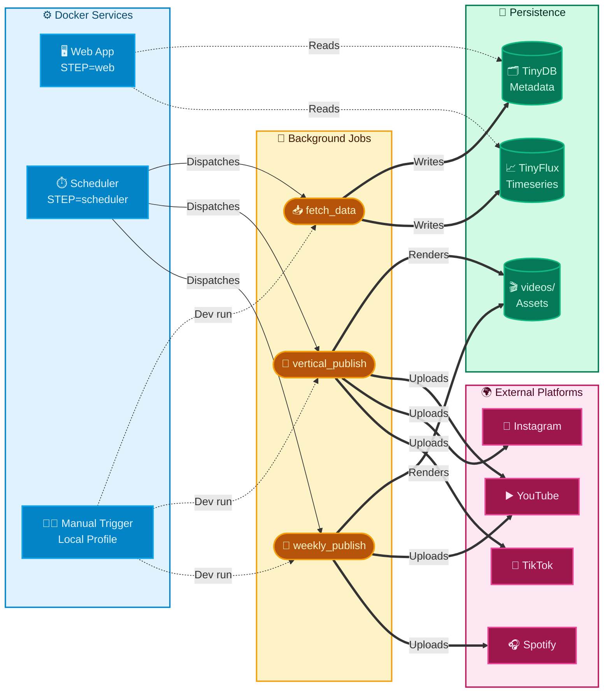

# Top Video Generator — Architecture Decision Record

## Status: Phase 2 complete; stabilization and incremental refactor in progress (2026-04-01)

## Overview

Automated pipeline: fetch YouTube trending music data → score and rank → render videos → publish to YouTube/Instagram/TikTok → update Spotify state.

The active architecture is hexagonal (Ports & Adapters). The migration away from legacy god files is largely complete.

## Current Layers

```text
src/
|- domain/           canonical models, ports, domain services
|- application/      use cases and orchestration
|- adapters/         source and publisher adapters
|- infrastructure/   youtube, storage, video, social, publisher registry
|- entrypoints/      api server, fetch/publish jobs, scheduler, workers
|- web/              FastAPI SSR delivery with split route modules
|- config/           Pydantic v2 settings
`- shared/           cross-cutting utilities (logging, locks, etc.)
```

Legacy modules `db_client.py`, `yt_client.py`, and `video_processing.py` are quarantined and must not be reintroduced.

## Layer Dependencies


## Runtime Topology



## ADR-001: TinyDB + TinyFlux

- **Decision:** keep TinyDB + TinyFlux for the current phase.
- **Rationale:** workload and deployment are still mostly single-instance.
- **Scope:** metadata should migrate to SQLite first if the current file-backed stores stop being operationally safe; time-series storage can be reassessed separately.
- **Revisit trigger:** sustained concurrent writers, stronger backup/restore requirements, richer metadata queries, or long-retention analytics needs.

## ADR-002: Scoring in Domain Service

- Scoring is canonically implemented in `src/domain/services/scoring_service.py`.
- Current state: main flows already call the domain scorer; remaining work is consistency hardening (shared fixtures, invariants, and regression tests around ranking semantics).

## ADR-003: Commit Messages

- Format: `type(scope): description`
- Avoid generic, context-free messages (e.g. `fix`, `update`).

## Current Priority Debt

1. **Observability:** `/metrics` is in-memory and not exported to a centralized backend.
2. **Scheduler resilience:** per-job isolation, retries, and non-fatal partial failures are still incomplete.
3. **Web contracts:** route-level input/output contracts and template boundaries need tighter tests.
4. **Storage:** migration readiness toward a multi-writer metadata store should be planned early, with SQLite as the first candidate.
5. **Path/runner conventions:** must stay enforced via smoke tests on every entrypoint or Docker wiring change.

## Improvement Roadmap

### Storage Roadmap: TinyDB to SQLite

TinyDB and TinyFlux are still acceptable for the current single-instance phase, but the storage layer needs a clear exit path before concurrency, retention, or backup requirements grow beyond what file-backed stores can safely provide.

#### Migration Criteria

Move metadata off TinyDB when one or more of these become true:

- Concurrent writes start happening from more than one long-lived process or worker group.
- We need ACID semantics, WAL-backed recovery, or reliable point-in-time backups.
- Metadata queries need indexes, stronger filtering, or more predictable performance than linear file scans.
- The size of the JSON database starts to affect write latency or startup time.
- Auth, release, or video metadata needs clearer operational tooling than a flat file can offer.

Time-series storage should be reviewed separately. TinyFlux can remain the right fit while the workload is append-heavy and operational analytics stay simple.

#### Phased Plan

##### Phase 1: Introduce a storage boundary

- Keep domain and application code unchanged.
- Isolate metadata access behind a repository contract in infrastructure.
- Preserve the canonical domain models across the boundary; do not leak TinyDB or SQLite payloads upward.

##### Phase 2: Add a SQLite implementation

- Implement the same repository behavior with SQLite as the target backend.
- Use explicit transactions and WAL mode for safer concurrent access.
- Keep the schema narrow for hot-path fields and use JSON only for optional flexible metadata.
- Reuse the current repository semantics first; schema optimization comes after functional parity.

##### Phase 3: Dual-write validation

- Write to TinyDB and SQLite in parallel for a short validation window.
- Compare counts, round-trips, and representative records.
- Capture write latency and `database is locked` failures before cutover.

##### Phase 4: Cut over readers

- Route reads to SQLite once parity is verified.
- Keep TinyDB as a temporary fallback only while the rollback window is open.
- Remove fallback behavior after a stable soak period.

##### Phase 5: Remove the legacy backend

- Delete the TinyDB-backed metadata implementation after the rollback window closes.
- Document backup, restore, and maintenance commands for SQLite.
- Re-run the storage tests against the new backend and lock the behavior with regression coverage.

##### Phase 6: Reassess time-series storage

- Keep TinyFlux until the time-series workload needs richer temporal aggregation, retention policies, or stronger multi-writer behavior.
- Prefer the simplest store that preserves the query shape the application actually needs.

#### Code Migration Examples

Current TinyDB shape:

```python
from pathlib import Path

from tinydb import TinyDB


class VideoRepository:
    def __init__(self, db_path: Path) -> None:
        self._db = TinyDB(str(db_path))
        self._table = self._db.table("video")
```

Target SQLite shape:

```python
from sqlalchemy.ext.asyncio import AsyncSession, async_sessionmaker

from src.domain.models import CanonicalVideo


class SqliteVideoRepository:
    def __init__(self, session_factory: async_sessionmaker[AsyncSession]) -> None:
        self._session_factory = session_factory

    async def upsert(self, video: CanonicalVideo) -> None:
        async with self._session_factory() as session:
            # VideoRow is the mapped SQLAlchemy model for the SQLite table.
            row = VideoRow.from_domain(video)
            session.add(row)
            await session.commit()
```

Temporary dual-write bridge:

```python
class DualWriteVideoRepository:
    def __init__(self, primary, shadow) -> None:
        self._primary = primary
        self._shadow = shadow

    async def upsert(self, video) -> None:
        await self._primary.upsert(video)
        await self._shadow.upsert(video)
```

These snippets are illustrative only. They show the migration shape: keep the domain model stable, change the persistence adapter, validate parity, then remove the old backend.

## Minimum Validation for Architecture-Relevant Changes

| Check | Command |
|---|---|
| Clean import | `python -c "import src"` |
| Lint | `ruff check src/ tests/` |
| Type check | `ty check src/` |
| Tests | Run tests relevant to touched areas |
