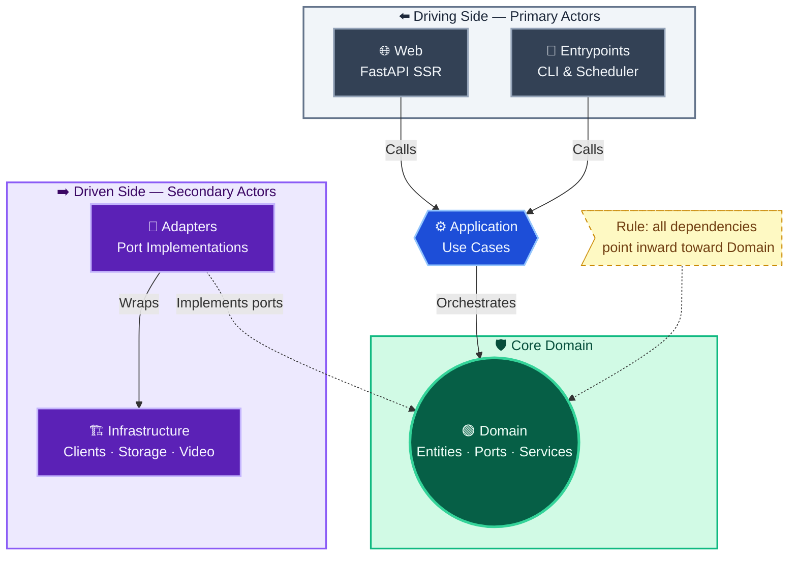
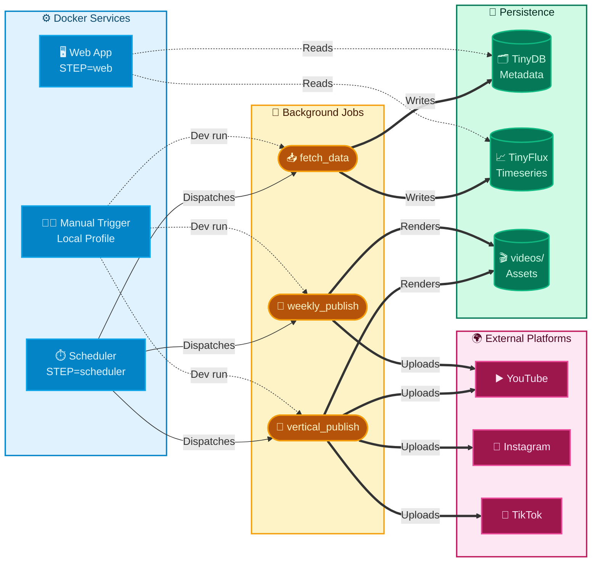

# Top Video Generator — Architecture Decision Record

## Status: Phase 1.5 complete (data resilience tests); Phase 2.1 skipped by YAGNI (single-instance); Phase 2.2 in progress (TaskRunState persistence) (2026-05-15)

## Overview

Automated pipeline: fetch YouTube trending music data → score and rank → render videos → publish to YouTube/Instagram/TikTok.

The active architecture is hexagonal (Ports & Adapters). The migration away from legacy god files is largely complete.

## Implementation Snapshot (2026-05)

- Hexagonal split is operational across `domain`, `application`, `adapters`, `infrastructure`, and web/entrypoint delivery layers.
- Canonical domain ports are stable and used by adapters (`TrendingVideoFetcher`, `TimeSeriesReader`, `VideoMetadataReader`, `AuthCredentialStore`, `ReleaseDateValidator`, `VideoPublisher`, `OAuthProvider[OAuthResultT]`).
- Structured logging and centralized settings are consistently applied (`src/shared/logging.py`, `src/config/settings.py`).
- Fetch-data orchestration now lives in `src/application/fetch_data_use_case.py` instead of the delivery entrypoint.
- Concurrent publishing uses `asyncio.TaskGroup` with per-platform failure capture in application orchestration, including fault isolation in the vertical publish flow.
- Integration connectivity checks are normalized at the application boundary so unexpected checker failures return stable `IntegrationCheckResult` values.
- Remaining boundary debt is concentrated in route/template contract coverage, scheduler resilience, and final entrypoint wiring simplification.

## Current Layers

```text
src/
|- domain/           canonical models, ports, domain services
|- application/      use cases and orchestration
|- adapters/         source and publisher adapters
|- infrastructure/   youtube, storage, video, social, publisher registry
|- entrypoints/      api server, fetch/publish jobs, scheduler, workers
|- web/              FastAPI SSR delivery with split route modules
|- config/           Pydantic v2 settings
`- shared/           cross-cutting utilities (logging, locks, etc.)
```

Legacy modules `db_client.py`, `yt_client.py`, and `video_processing.py` are quarantined and must not be reintroduced.

## Layer Dependencies



## Entrypoint Boundaries (Clarification)

Entrypoints are thin orchestration layers only.

- Allowed: load settings, build use cases/adapters, trigger workflows, report outcomes.
- Not allowed: business scoring rules, ranking logic, manual cross-layer data shaping, release-window domain decisions.
- Fetch-data orchestration now lives in `src/application/fetch_data_use_case.py`, and weekly horizontal publish orchestration now lives in `src/application/publish_video_use_case.py`; remaining migration gaps are concentrated in selected entrypoint dependency wiring and web contract hardening.

Target direction:

- Keep entrypoint logic as: parse config -> call use case -> emit operational logs.
- Continue shrinking publish entrypoints toward the same model: thin delivery shell, application-owned orchestration.

## FastAPI Dependency Injection Pattern

The web layer uses `Annotated[...]` + `Depends(...)` factories in `src/web/dependencies.py`.

- Settings resolve through request-scoped app state first (`request.app.state.settings`), then fallback to `get_app_settings()`.
- Route handlers receive typed use cases/ports through dependency aliases.
- Unit tests can override factories with `app.dependency_overrides` without mutating process-global environment.

This pattern keeps web routes thin and improves deterministic test setup.

## Async Publishing Pattern

Publishing fan-out is coordinated with `asyncio.TaskGroup` in application/use-case flows.

- One task per platform publisher.
- Per-task exceptions are captured and converted to `PublishingResult(success=False, error=...)`.
- Partial failures are reported without aborting the whole batch unless a use case explicitly requires fail-fast behavior.

This behavior is implemented in `src/application/publish_video_use_case.py` and `src/application/publish_vertical_use_case.py` and should remain the default for multi-platform publishing.

## Runtime Topology



## ADR-001: TinyDB + TinyFlux

- **Decision:** keep TinyDB + TinyFlux for the current phase.
- **Rationale:** workload and deployment are still mostly single-instance.
- **Scope:** metadata should migrate to SQLite first if the current file-backed stores stop being operationally safe; time-series storage can be reassessed separately.
- **Revisit trigger:** sustained concurrent writers, stronger backup/restore requirements, richer metadata queries, or long-retention analytics needs.

## ADR-002: Scoring in Domain Service

- Scoring is canonically implemented in `src/domain/services/scoring_service.py`.
- Current state: main flows already call the domain scorer; remaining work is consistency hardening (shared fixtures, invariants, and regression tests around ranking semantics).

## ADR-003: Commit Messages

- Format: `type(scope): description`
- Avoid generic, context-free messages (e.g. `fix`, `update`).
## ADR-004: Release Kind Transition Policy

- **Decision:** Implement staged transition from `release_kind=null` legacy compatibility to strict `release_kind` requirement.
- **Current phase (Phase 2.0):**
  - Reads: accept null (fallback to DAILY_VERTICAL).
  - Writes: always include explicit `release_kind`.
  - Telemetry: track count of legacy null reads; fail-fast if residual legacy > threshold.
- **Phase 2.1 (Day 30 in 30/60 roadmap):** Backfill null → inferred kind in `db_release.json`.
- **Phase 2.2 (Day 60):** Reads no longer accept null; any remaining null → error + operator alert.
- **Rationale:** Eliminates ambiguity in daily vs weekly idempotence checks; allows confident separation of publish workflows by schedule.
## Current Priority Debt

1. **Task state persistence:** TaskRunState (task execution history) is being migrated to TinyFlux-backed persistence for admin observability and durable task status history.
2. **Publisher factory refactoring:** Publish entrypoint dependency wiring is still repeated across `publish_video.py` and `publish_vertical.py`; needs extraction into shared factory.
3. **Health dashboard:** Admin panel needs operational visibility (task history, storage integrity, recent errors). Requires TaskRunState persistence + metrics export (Fase 2.3-2.4).
4. **Scheduler observability:** Scheduler job heartbeats and isolation reporting need hardening to detect stuck jobs and partial failures quickly.
5. **Migration gating:** SQLite migration decision deferred to Fase 3 pending Fase 2.5 metrics (per-instance data volume, lock contention, timeseries query patterns).

## Operational State Semantics

Canonical task states and their sources of truth:

| State | Meaning | Source | Transition Trigger |
|-------|---------|--------|--------------------|
| **Requested** | Task triggered by operator; execution not started | TaskRunState.status | Immediate feedback from trigger endpoint |
| **Running** | Job process executing (fetch_data / publish_vertical / publish_video) | TaskRunState.status + background job start signal | Background job heartbeat after acquired lock |
| **Succeeded** | Job completed without error; artifacts written (videos, releases, metrics) | TaskRunState.status + background job completion signal | Background job exit code 0 + state persist |
| **Failed** | Job terminated with error; may have partial artifacts | TaskRunState.status + background job error signal + error detail | Background job exception caught + state persist with error |

**Key invariant:** "Requested" does NOT imply execution will start or succeed. Admin feedback must always clarify "acceptance of request" not "confirmation of success".

**Admin panel cards:**
- Daily/Weekly task cards show last TaskRunState, not inferred timestamp.
- Trigger endpoint feedback remains request-acceptance semantics only; final success/failure is sourced from persisted TaskRunState events.

## Immediate Next Steps

**Fase 2.1: YAGNI Decision (Closed)**
- ✅ Single-machine, single-instance runtime confirmed.
- ✅ TinyDB + TinyFlux retained (no atomic-storage migration in this phase).
- ✅ Concurrency-hardening work deferred unless architecture shifts to multi-instance writers.

**Fase 2.2-2.5: Structural Improvements**
- 🔄 Persist `TaskRunState` (task execution history) to TinyFlux-backed repository and use it as source of truth for admin task status.
- Extract publisher dependency factories from publish entrypoints
- Build operational health dashboard (task history, error timeline, recent events)
- Collect metrics for SQLite migration decision gate (Fase 3)

**Validation:** All fases require `make pre-push-check` pass gate + new test coverage for behavior changes.

## Next Steps: 30/60-Day Analysis Plan

### 30-Day Window (Quick Wins, Low Effort — Can Run in Parallel)

These three items are standalone and require no structural changes.

**1. Complete LOW-Priority Settings Cleanup**
- **Task:** Remove unused settings (`yt_search_language_code`, `yt_search_category_code` already verified active; identify truly unused ones).
- **Scope:** Audit `src/config/settings.py` for deprecated toggles; confirm no lingering references.
- **Effort:** 1 session (~1 hour)
- **Validation:** All tests pass; `make pre-push-check` green; no new `reportUnusedVariable` warnings.
- **Rationale:** Keeps settings file lean and operational awareness high.

**2. Harden Web Route Error Messages**
- **Task:** Ensure all adapter error exceptions map to actionable user-facing messages in route handlers instead of generic 500 responses.
- **Examples:** Instagram login failure → "Invalid credentials"; TikTok cookie expired → "Refresh cookies".
- **Scope:** Touch `src/web/routes/` handlers that wrap publish and platform-check use cases.
- **Effort:** 2–3 sessions (~2 hours)
- **Validation:** Manual web UX tests; existing route handler unit tests still pass.
- **Rationale:** Improves operator debugging without distributed logging; single-server advantage.

**3. Expand Integration Checker Error Resilience**
- **Task:** Verify all integration checkers catch platform SDK exceptions and return stable `IntegrationCheckResult(status=ERROR, reason=...)` instead of uncaught stack traces.
- **Current State:** Validate YouTube, Instagram, TikTok.
- **Scope:** `src/adapters/{platform}_integration_checker.py` files.
- **Effort:** 1 session (~45 minutes)
- **Validation:** Raise SDK exceptions in test mocks; confirm use case returns ERROR, not exception.
- **Rationale:** Admin panel reliability; single-server simplicity.

---

### 60-Day Window (Structural Improvements, Medium Effort — Sequential, Depends on 30-Day Baseline)

These three items unlock observability, resilience, and entrypoint simplification.

**1. Scheduler Fault Isolation and Heartbeat Visibility**
- **Task:** Extend scheduler job isolation so that one job failure (fetch_data exception, publish_video timeout, etc.) does not crash the scheduler process or suppress other scheduled tasks.
- **Current State:** Jobs catch exceptions; scheduler main loop is stable. Missing: per-job heartbeat logging and lingering background task cleanup.
- **Scope:** `src/entrypoints/scheduler.py` and job dispatch behavior.
- **Effort:** 2–3 sessions (~3 hours)
- **Validation:** Write integration tests that raise exceptions in use cases; confirm scheduler continues and logs heartbeat events.
- **Rationale:** Single-server reliability; operator visibility without a message queue or centralized logging.
- **Follow-up:** Scheduler logs will show which tasks are stuck; can then add timeouts or async cleanup in subsequent work.

**2. Entrypoint Dependency Wiring Factory (Simplify Publish Entrypoints)**
- **Task:** Consolidate shared dependency-building logic from publish entrypoints into a reusable factory.
- **Current State:** `publish_vertical.py` already uses a context dataclass and factory functions; `publish_video.py` now delegates orchestration to `WeeklyHorizontalPublishUseCase` and should continue moving shared wiring into factory modules.
- **Scope:** Consolidate repository and adapter initialization into `src/entrypoints/_publisher_factories.py` or similar module.
- **Effort:** 2 sessions (~2 hours)
- **Validation:** All entrypoint integration tests still pass; no behavior change; code is simpler to read.
- **Rationale:** Sets template for future entrypoints; reduces copy-paste risk.

**3. Optional Storage Safety (Graceful Degradation for TinyDB/TinyFlux Missing Data)**
- **Task:** Verify that absence of historical data (e.g., empty timeseries on startup, corrupted release metadata) does not crash publish flows.
- **Current State:** Scoring logic falls back to default ranking; publish logic validates metadata before use.
- **Scope:** Unit tests for edge cases: no timeseries records, no video metadata, malformed JSON in storage.
- **Effort:** 2 sessions (~2 hours)
- **Validation:** Write parametrized tests for edge cases; confirm flows return graceful error results or skip safely.
- **Rationale:** Operational resilience without a distributed store; important for single-server deployments where manual recovery is the only option.

---

### Validation Strategy per Window

**30-Day Checkpoints:**
- Day 7: LOW settings audit complete and documented.
- Day 14: Web route error messages updated; manual smoke test.
- Day 21: Integration checker tests expanded; all checkers return stable results.
- Day 30: All three items merged; `make pre-push-check` passes; no test regressions.

**60-Day Checkpoints:**
- Day 37: Scheduler isolation tests written; one failed job no longer cascades.
- Day 44: Entrypoint factory extracted; both publish entrypoints refactored.
- Day 51: Storage edge-case tests written and passing.
- Day 60: All improvements merged; scheduler stability verified in test environment.

---

### Rationale: Why Not Prometheus/Broker/Metadata Migration?

**Prometheus metrics backend:** Out of scope because metrics are currently in-memory counters observed via the `/metrics` route. A centralized backend requires infrastructure, scraping, and multi-instance complexity. Single-server logs provide sufficient observability until workload scales to multiple instances.

**Message broker (Redis/RabbitMQ):** Out of scope because all jobs are orchestrated from a single scheduler and entrypoints. Async retry, job queuing, and worker pools make sense only after distributed deployment. Current single-server design has no distributed failure modes that a broker would solve.

**Migrating metadata off TinyDB:** Out of scope because the current file-backed approach remains operationally sound for a single-server workload. The revisit criteria in ADR-001 have not been met. A metadata migration is expensive, brings new failure modes (database connection, schema changes), and benefits only multi-instance deployments or very large datasets.

## Explicit Non-Goals

- Prometheus or any centralized metrics backend is out of scope while the application continues to run on a single server.
- A message broker such as Redis or RabbitMQ is out of scope because the workload is not distributed across multiple machines.
- Replacing TinyDB metadata storage is out of scope for the current project phase; the existing single-server file-backed approach is still acceptable for the current workload.

## Improvement Roadmap

### Storage Notes: Single-Server Persistence

TinyDB and TinyFlux are still acceptable for the current single-server phase. The project does not currently plan a metadata migration because the operational model is intentionally simple and local.

#### Revisit Criteria

Revisit the storage decision only if one or more of these become true:

- Concurrent writes start happening from more than one long-lived process or worker group.
- We need ACID semantics, WAL-backed recovery, or reliable point-in-time backups.
- Metadata queries need indexes, stronger filtering, or more predictable performance than linear file scans.
- The size of the JSON database starts to affect write latency or startup time.
- Auth, release, or video metadata needs clearer operational tooling than a flat file can offer.

Time-series storage should be reviewed separately. TinyFlux can remain the right fit while the workload is append-heavy and operational analytics stay simple.

## Anti-Patterns & CI Guardrails

Enforced via pre-commit + ruff rules:

1. **Legacy module re-introduction:** Imports from `src.db_client`, `src.yt_client`, `src.video_processing` → CI rejection.
2. **Business logic in entrypoints/web:** Scoring, ranking, release validation outside domain/application → PR comment + requirement to move.
3. **Protocol runtime checks:** `isinstance(..., VideoPublisher)` module-level → linting failure.
4. **Pydantic v1 APIs:** `Optional[X]` instead of `X | None` in new code → linting failure.
5. **Mutable default args:** `def func(x={}):` → linting failure.
6. **Raw API dicts crossing boundaries:** Domain/application receive canonical models, not raw JSON/SDK objects → architectural review.

## Minimum Validation for Architecture-Relevant Changes

| Check | Command |
|---|---|
| Clean import | `python -c "import src"` |
| Lint | `ruff check src/ tests/` |
| Type check | `ty check src/ tests/` |
| Tests | Run tests relevant to touched areas |
