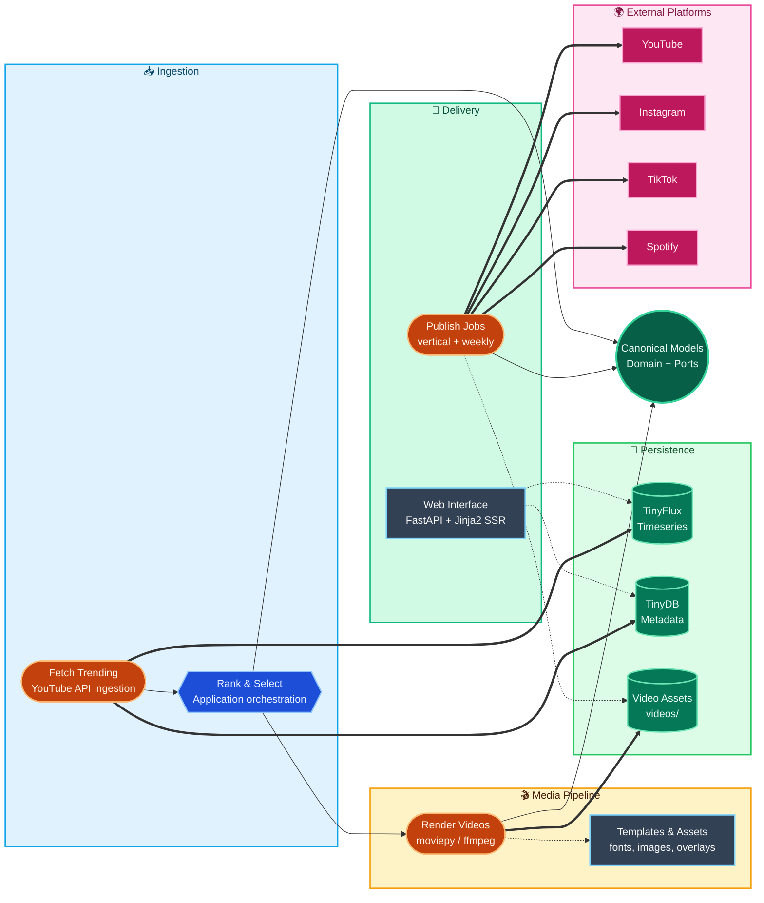

# top-video-generator

Generate automatically a video resume with the most view growing in a weekly/daily basis.

## Architecture Overview

This application fetches daily/weekly top YouTube music videos for a configured region (currently Bollywood/India), stores timeseries data and metadata, generates videos (horizontal and vertical formats), and publishes to YouTube, Instagram, TikTok, and Spotify playlists.

The diagram below is intentionally high-level. Detailed layer boundaries, migration status, and architecture rules are maintained in `ARCHITECTURE.md`.

### System Components



Scoring note: ranking logic is canonically implemented in `src/domain/services/scoring_service.py` and orchestrated by application/use-case flows. Some entrypoint flows are still being migrated to keep business rules out of delivery code.

### Key Components

#### 1. Data Ingestion (`src/entrypoints/fetch_data.py`)
- Scheduled daily fetch from YouTube API
- Stores video metadata and view counts
- Calculates view growth and rankings
- Writes to TinyFlux (timeseries) and TinyDB (metadata)

#### 2. Video Processing Pipeline
- **Downloader** (`src/infrastructure/video/downloader.py`): Uses yt-dlp to fetch source videos
- **Processing** (`src/infrastructure/video/compositor.py`, `src/infrastructure/video/renderer.py`): Composites templates, overlays, and transitions
- **Workers** (`src/entrypoints/workers/post_processor.py`): ZeroMQ-based parallel processing

#### 3. Publishing Scripts
- **Daily Vertical** (`src/entrypoints/publish_vertical.py`): Top 5 videos, vertical format for Reels/Shorts
- **Weekly Horizontal** (`src/entrypoints/publish_video.py`): Top videos, horizontal format for YouTube

#### 4. Platform Clients
- **YouTube** (`src/infrastructure/youtube/yt_client.py`): OAuth2, video upload, playlist management
- **TikTok** (`src/infrastructure/social/tiktok_client.py`): OAuth2, video upload with chunked transfer
- **Spotify** (`src/infrastructure/social/spotify_client.py`): OAuth2, playlist management
- **Instagram** (`src/infrastructure/social/instagram_client.py`): Session-based auth via instagrapi

#### 5. Web Interface (`src/web/main.py`)
- FastAPI + Jinja2 SSR
- OAuth callback handlers for all platforms
- Video ranking viewer with date navigation
- Background task triggers

### Technology Stack

- **Backend**: Python 3.13, FastAPI, Pydantic
- **Video**: moviepy, yt-dlp, ffmpeg, PIL
- **Storage**: TinyFlux (timeseries CSV), TinyDB (JSON)
- **Web**: Jinja2 templates, HTMX-ready
- **Deployment**: Docker, Docker Compose
- **Package Management**: uv (ultrafast Python package manager)

### Configuration

All configuration is via environment variables with `TOP_MUSIC_` prefix:

```bash
# Copy .env.example to .env for local runs and Docker Compose.
# Use .env.local only if you want an optional untracked override on the same machine.
# Paths in .env and .env.local are resolved from the repository root.
# Run uv, make, and docker compose commands from the repository root.

# Core settings
TOP_MUSIC_ENV=production|development
TOP_MUSIC_DAYS_BETWEEN_TOP=7

# YouTube API
TOP_MUSIC_YT_CLIENT_SECRET_FILE=secrets/yt_client_secret.json
TOP_MUSIC_YT_SEARCH_REGION_CODE=IN
TOP_MUSIC_YT_SEARCH_LANGUAGE_CODE=hi

# Platform credentials (see .env.example)
```

### Current Architecture Issues

1. **Entrypoint Boundary Debt**: some job entrypoints still include business shaping/orchestration logic that should be moved into dedicated application use cases.

2. **Web Delivery Layer Stabilization**: route modules are split under `src/web/routes/`, but route-level contracts and template boundary tests still need hardening.

3. **Monolithic Deployment**: A single container still handles fetch, processing, publishing, and web delivery via the `STEP` environment variable.

4. **Local Storage Limits**: TinyDB and TinyFlux remain a good fit for single-instance deployments, but they still lack native concurrency controls and stronger operational tooling.

5. **Process-Local Observability**: `/health` and `/metrics` exist, but metrics are in-memory and local to a single process, not centralized or Prometheus-compatible.

6. **Scoring Consistency**: Domain scoring service is canonical, but consistency hardening and regression coverage should continue for ranking semantics.

### Improvements Implemented

✅ **Hexagonal Split** (`src/domain`, `src/application`, `src/adapters`, `src/infrastructure`): Core migration out of legacy god files is completed
✅ **Async Isolation** (`src/infrastructure/`): Blocking integrations are isolated with `asyncio.to_thread()`
✅ **Retry Utilities** (`src/utils/retry.py`): Exponential backoff with jitter for resilient uploads
✅ **Health Checks** (`/health` endpoint): Validates ffmpeg, templates, database
✅ **Metrics** (`/metrics` endpoint): Tracks fetch/upload/processing counts and errors
✅ **CI/CD** (`.github/workflows/ci.yml`): Automated testing, linting, type checking

### Planned Improvements

- [ ] Message broker (Redis/RabbitMQ) for reliable task queuing
- [ ] Separate container services for ingest/process/publish
- [ ] Migrate metadata storage from TinyDB to SQLite
- [ ] Add Prometheus metrics export
- [ ] Implement dead-letter queue for failed uploads
- [ ] Add integration tests with mocked external APIs

## Quick Start

### Prerequisites

- Python 3.13
- ffmpeg installed
- ImageMagick installed
- Docker (optional)

### Local Development

Important: the file paths configured in `.env` and `.env.local` are relative to the repository root. Run the commands below from the repository root so paths like `secrets/...`, `db/...`, `logs/...`, and `src/resources/...` resolve correctly.

```bash
# Install dependencies and git hooks
make dev-install
make install-hooks

# Run web server
uv run api-server

# Run data fetch
uv run fetch-data

# Run daily publish
uv run publish-vertical

# Run weekly publish
uv run publish-video

# Dry-run legacy db migration (no writes)
uv run migrate-legacy-data

# Apply legacy db migration (creates source backup)
uv run migrate-legacy-data --apply

# Run quality checks
make quality

# Run the full pre-push gate manually
make pre-push-check
```

### Optional Spotify Support

Spotify support is now packaged as an optional extra instead of a mandatory base dependency.

Use the default install if you do not need Spotify features:

```bash
uv sync --all-groups
```

Install the Spotify extra only when you want Spotify integration enabled:

```bash
uv sync --all-groups --extra spotify
```

If the Spotify extra is not installed, the application still starts normally, but Spotify-specific flows will fail with a clear installation hint when invoked.

### Spotify OAuth Troubleshooting

If the admin live check shows Spotify errors such as:

- `refresh_token must be supplied`
- `Only valid bearer authentication supported`

your stored Spotify authorization is usually expired or revoked.

What to do:

1. Open the Setup page in the web app and reconnect Spotify.
2. Run the Spotify live connection check again from Admin.
3. Re-run the daily publish job after the check is `VERIFIED`.

Runtime behavior: the vertical publish flow now skips Spotify playlist updates when authorization is invalid, so YouTube/TikTok/Instagram publishing continues.

### Optional TikTok Support

TikTok publishing now depends on the optional `tiktok` extra.

Use the default install if you do not need TikTok publishing:

```bash
uv sync --all-groups
```

Install the TikTok extra only when you want TikTok integration enabled:

```bash
uv sync --all-groups --extra tiktok
```

TikTok uploader runtime also requires Playwright browser binaries:

```bash
uv run playwright install
```

### Git Hooks

This repository uses pre-commit as the single hook runner for both commit and push checks.

Run this once per clone:

```bash
make install-hooks
```

What happens after that:

- `git commit` runs the `pre-commit` stage with fast checks for merge conflicts, private keys, whitespace cleanup, `ruff check --fix`, and `ruff format`.
- `git push` runs the `pre-push` stage with the full repository gate: `make quality` plus `pytest tests/ -x -q --ignore=tests/integration/video`.

Important: a commit can pass and a push can still fail. This is expected because `pre-push` runs stricter checks (including `ty check` through `make quality`) that are not part of the fast `pre-commit` stage.

Useful manual commands:

```bash
# Run all pre-commit hooks across the repository
make pre-commit-run

# Run the same checks used by the pre-push hook
make pre-push-check
```

If this clone used the older tracked `.githooks/` setup before, rerun `make install-hooks` to migrate to the native `.git/hooks` installation managed by pre-commit.

### Docker

The commands below also assume you are in the repository root.

```bash
# 1) Prepare local config and secrets
cp .env.example .env
mkdir -p prod/videos prod/logs secrets

# 2) Fill .env and place secrets under ./secrets
#    - ./secrets/yt_client_secret.json
#    - ./secrets/instagram_session.json (optional if Instagram is disabled)
#
# Optional: create .env.local if you want an extra untracked override layer.

# 3) Pull and start the long-running services
docker compose pull
docker compose up -d web scheduler

# Run a specific step manually
docker compose run --rm -e "STEP=fetch_data" top-video-generator
```

The default production topology now runs two services from the same image:

- `web`: FastAPI application on port `8080`
- `scheduler`: internal 24/7 scheduler that runs `fetch_data`, `vertical_publish`, and `weekly_publish`

The tracked `.env.example` file is now the single template for both local runs and Docker Compose. Put real secrets in `.env`, and use `.env.local` only as an optional untracked override.

## License

MIT
